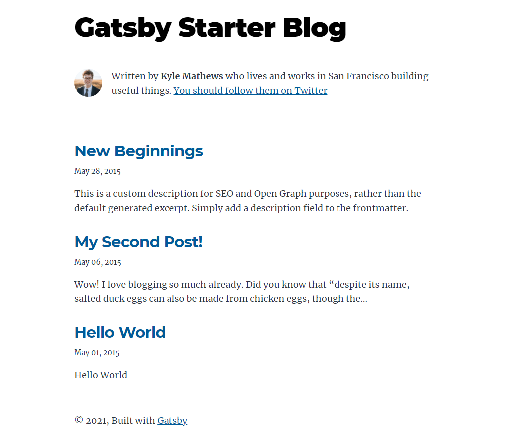

## **Gatsby**

 [gatsby](https://www.gatsbyjs.com/)는 빌드 시 필요한 콘텐츠와 페이지를 생성하는 정적사이트 생성기로

 react 기반에 좋은 성능과 쉬운 배포가 가능해 선택하게 되었다. 

나는 빠른 시작을 위해 스타터 템플릿중 심플한 [gatsby-starter-blog](https://github.com/gatsbyjs/gatsby-starter-blog) 를 사용했다

```shell
npm i -g gatsby-cli

gatsby new my-gatsby-project https://github.com/gatsbyjs/gatsby-starter-blog

gatsby devlop
```


<http://localhost:8000/>로 접속하면 아래와 같은 화면을 확인 할 수 있다.




<br/>

#### 댓글

댓글기능은 [utterances](https://utteranc.es/) 를 사용했는데 github Issue 기반으로 comment를 관리할 수 있고

무료로 가볍고 댓글 알림을 받을 수 있다는 장점이 있다.

<br/>

사용 방법은 Utterances 컴포넌트를 생성 한다.

```javascript
import React, { createRef, useLayoutEffect } from 'react';

const src = 'https://utteranc.es/client.js';

export interface IUtterancesProps {
  repo: string;
  theme: string;
}

const Utterances: React.FC<IUtterancesProps> = React.memo(({ repo, theme }) => {
  const containerRef = createRef<HTMLDivElement>();

  useLayoutEffect(() => {
    const utterances = document.createElement('script');

    const attributes = {
      src,
      repo,
      'issue-term': 'pathname',
      label: 'comments',
      theme: 'github-light',
      crossOrigin: 'anonymous',
      async: 'true',
    };

    Object.entries(attributes).forEach(([key, value]) => {
      utterances.setAttribute(key, value);
    });

    containerRef.current!.appendChild(utterances);
  }, [repo]);

  return <div ref={containerRef} />;
});

Utterances.displayName = 'Utterances';

export default Utterances;
```

<br/>

원하는 위치에 컴포넌트를 추가한

```javascript
<Utterances repo="Leejiho93/blog-comments" />
```


<br/>

## **Netlify** 

 [netlify-cms](https://www.netlifycms.org/)는 [github](https://github.com/)기반 콘텐츠 관리 도구로, 마크다운 파일로 콘텐츠를 작성하고 관리해준다.

 [netlify](https://www.netlify.com/) 클릭 몇번으로 배포부터 무 https 호스팅이 가능하다는 점이 신기하고 편했다


<br/>

<br/>

### Reference

<https://velog.io/@iamchanii/build-a-blog-with-gatsby-and-typescript-part-4>  댓글

<https://heropy.blog/2018/01/10/netlify/>   배포

<https://yohanpro.com/posts/gatsby-search>  검색